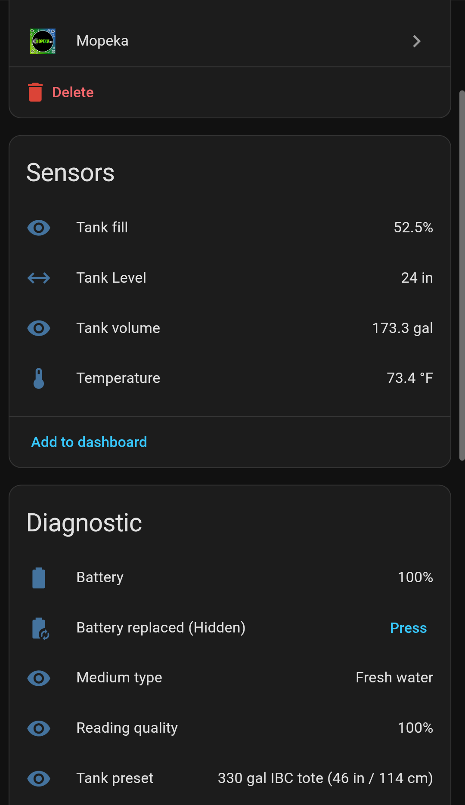
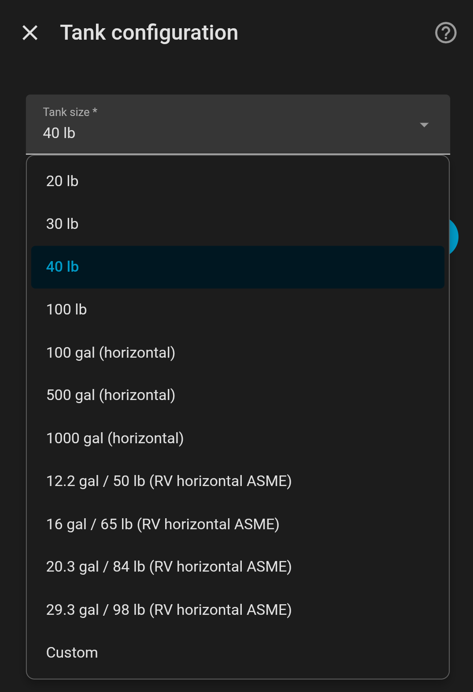
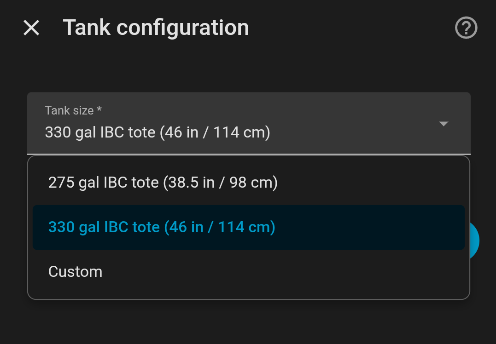

# Mopeka Enhanced

> **Development Status:** This integration is under active, heavy development. Code changes and updates are frequent. Please review the latest release notes to check for important changes or migration guidance.

## Intro

This is an enhanced version of Home Assistant's native Mopeka integration by `@bdraco`. It continues to use the mopeka_ble_iot library to interface with the sensors. No changes have been made there. 

The code changes I have made are primarily to add tank presets, new sensors, calculations for horizontal tank geometry, and an updated config flow. In the native integration you were only presented with a sensor that displayed the fluid level in inches. This isn't very useful, and it was up to you to create the proper template sensors to display percentage or gallons based on your tank geometry.

No longer! 

Now you can choose from a number of preset tank types which will then automatically create percentage and volume sensors for you. Don't see your tank type in the list? No worries! You can also enter a custom tank height and capacity rating during set up. 

This custom Mopeka integration will override the native HA integration while keeping any preconfigured Mopeka devices intact. You will have to reconfigure your existing Mopeka devices to use the new tank presets and show the updated tank sensors.

## AI Disclaimer

Was this vibecoded? Yup!

I'm not a developer, but I am an IT Systems Engineer, so I have a good grasp on what I'm doing. As mentioned, this builds on the original Mopeka code from HA core. The heavy lifting for the enhancements was done with Github Copilot (Claude Opus/Sonnet) in VScode using the Home Assistant dev container environment. The research and verification however was done by me.

All HA and HACS standards have been followed, and all coding tests passed. Real world sensor readings using the integration enhancements were conducted on my 40 lb vertical propane tank, 100 lb horizontal propane tank, and my 330 gallon IBC tote (fresh water). The readings match the Mopka app so well, and in most cases display even more accurate measurements due to the enhancements made here!

I 100% welcome others to improve upon this work. Find any mistakes I made, make things more efficient, improve the documentation, or add additional tank presets. Maybe some day we can get these changes merged into the HA core integration!

## Features

 🛢️ Tank presets for US and Euro horizontal and vertical style propane tanks in gal/lbs/kg (Sourced from the Mopeka Tank App)

 🚰 Standard IBC tote presets for 275 gallon and 330 gallon sizes (available for all non-propane medium types)

 📏 Option to define your own custom tank height in millimeters, and tank volume in gal/lbs/kg

 📡 Automatic detection of top mount sensor models (TD40 and TD200) for correct sensor measurements

 🧭 Updated config flow menu for tank configuration based on medium type selection and device detection (top mount sensors)

 🧮 Background calculations for horizontal tank geometry (hemisphere endcaps)

 📊 Tank Level sensors that display percentage and gal/lbs/kg

 📊 Diagnostic sensors to display the currently selected medium (fluid) type, and tank preset 

## A word on tank presets

The tank preset data for the integration was sourced from the `tank_types.js` file extracted from the Mopeka tank.apk. Almost all of the tank presets in this enhanced integration use the dimensions from `tank_types.js`, with the exception of the ASME tanks and IBC totes. These type of tanks were never included in the Mopeka app, so I had to source these dimensions from internet research (with the help of Gemini). There are a lot of regions defined in this file for tank sizes, but I'm only using the US and Euro ones at the moment. I'll add more regions as time permits.

For more details on all the available types and associated regions, head to my other repo here: https://github.com/bb12489/mopeka-tank-types

## Screenshots

### Sensors

### Propane Presets

### IBC Presets

### Custom Tanks

## Horizontal Tank Geometry

For horizontal propane presets, tank fill is calculated with non-linear geometry from the integration code in `custom_components/mopeka/sensor.py`. This is something that was never part of the official Mopeka app. They never took into account any type of tank geometry for their measurements, so you'll likely see readings that don't exactly match the Mopeka app at times. This is fine since our readings will be a lot  more accurate than theirs!

The key formula uses the circular segment area of a horizontal cylinder cross-section:

$$
A(h) = r^2 \cdot \arccos\left(\frac{r-h}{r}\right) - (r-h) \cdot \sqrt{2rh-h^2}
$$

where:

- $h$ is measured liquid height in mm
- $r = \frac{\text{diameter}}{2}$
- normalized fraction is:

$$
f(h) = \frac{A(h)}{\pi r^2}
$$

The integration then adjusts for the configured empty offset (`empty_mm`) and computes fill percentage as:

$$
\mathrm{fill\_pct} = \frac{f(h_{reading}) - f(h_{empty})}{1 - f(h_{empty})} \times 100
$$

### Worked example (500 gal horizontal preset)

Using preset values from the integration:

- `empty_mm = 38.1`
- `full_mm (diameter) = 939.8`
- sample reading `h_reading = 469.9`

Computed values:

- $f(h_{empty}) = 0.01369$
- $f(h_{reading}) = 0.5$
- Fill percentage = 49.31%

If total configured capacity is 500 gal, then tank volume is:

$$
\mathrm{volume} = 0.4931 \times 500 = 246.53\,\mathrm{gal}
$$

### Why this matters (especially with hemispherical endcaps)

Horizontal tanks are not linear: a 10 mm change near the bottom does not represent the same volume change as 10 mm near the middle. A simple linear height-to-percent conversion would over/under-estimate fuel at different fill levels.

Many horizontal propane tanks also have rounded/hemispherical endcaps, which further separate true volume from a naive linear model. This integration improves practical accuracy by using non-linear cylindrical geometry for fill percentage and then applying the configured tank capacity for final gallons.

## Installation (HACS)

1. Open HACS in Home Assistant.
2. Go to Integrations.
3. Open the three-dot menu and select Custom repositories.
4. Add `https://github.com/bb12489/mopeka-enhanced` as category `Integration`.
5. Search for `Mopeka Enhanced` in HACS and install it.
6. Restart Home Assistant.

After restart, add or reconfigure your Mopeka devices from Settings -> Devices. 

Mopeka Enhanced doesn't modify any existing Mopeka tank sensors after installation. So you won't automatically see the new tank level/volume sensors until you reconfigure them with a new tank preset, or by defining a custom height/capacity. 

## Acknowledgment

This custom component builds on the original Mopeka integration from Home Assistant Core.
Credit to the original upstream maintainer and codeowner, `@bdraco`, for the core integration foundation.

## Development

The integration code lives in `custom_components/mopeka`.

### Local Dev Setup

1. Create and activate a Python virtual environment.
2. Install development dependencies:
	.\\.venv\\Scripts\\python.exe -m pip install -r requirements-dev.txt

### Local Validation Commands

1. Run tests:
	.\\.venv\\Scripts\\python.exe -m pytest -q
2. Run lint checks:
	.\\.venv\\Scripts\\python.exe -m ruff check custom_components tests
3. Run formatting checks:
	.\\.venv\\Scripts\\python.exe -m ruff format --check custom_components tests

### Hassfest And HACS Validation

Hassfest and HACS validation in this repository are currently action-based checks via GitHub workflows:

1. HACS validation workflow: `.github/workflows/validate.yml`
2. Hassfest workflow: `.github/workflows/hassfest.yml`

You can trigger these workflows from GitHub Actions on pushes/PRs (or manually via workflow dispatch where available).

## License

This project is released under the MIT license. See `LICENSE`.
