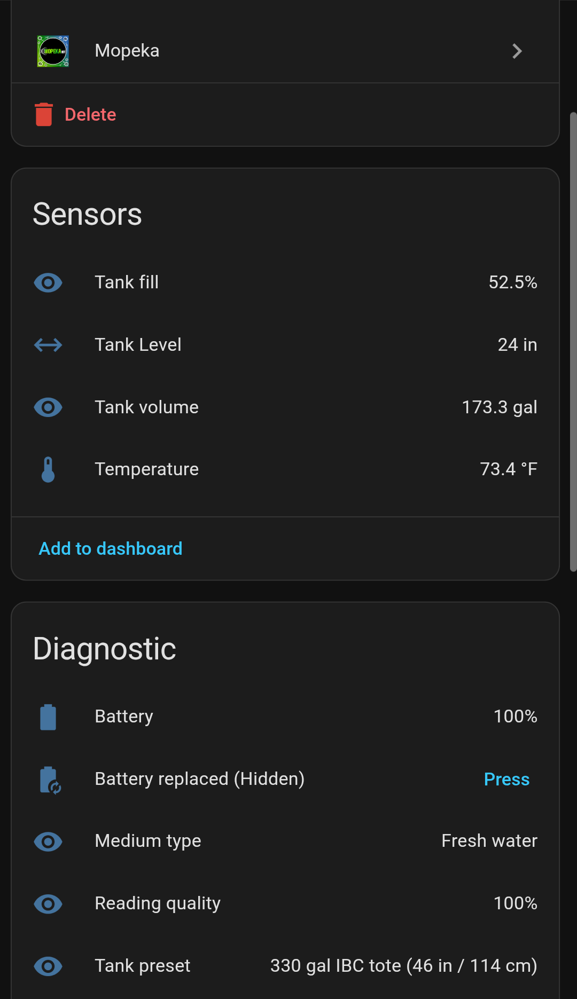
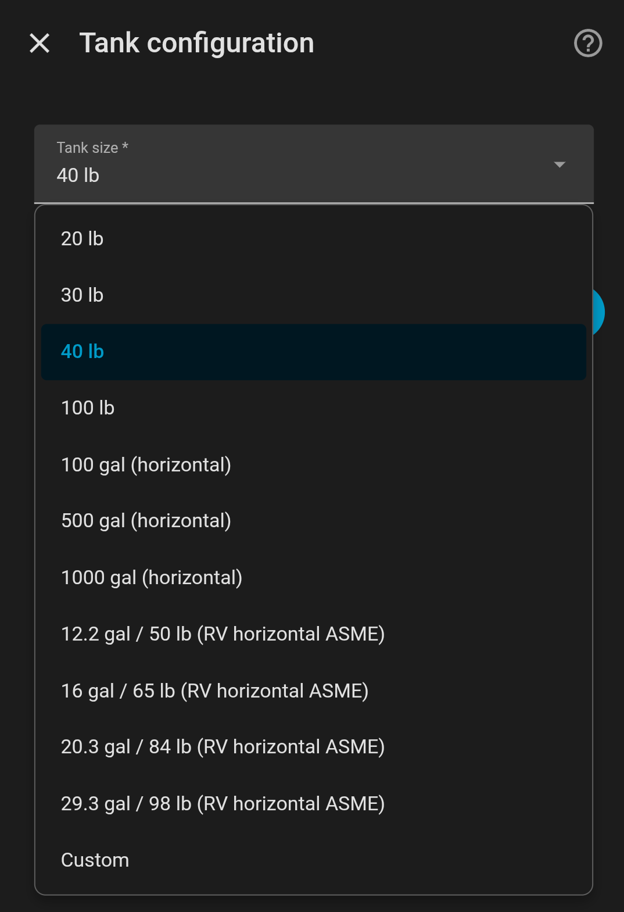
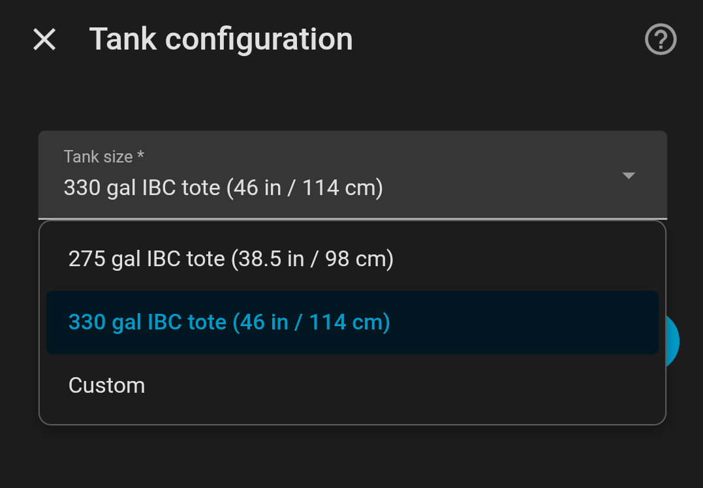

# Mopeka Enhanced

> **Development Status:** This integration is under active, heavy development. Code changes and updates are frequent. Please review the latest release notes to check for important changes or migration guidance.

        

## Intro

This is an enhanced version of Home Assistant's native Mopeka integration by `@bdraco`. It uses the same `mopeka_iot_ble` library to talk to the sensors — no changes there.

The native integration only gives you a raw fluid-level sensor in inches, leaving you to build your own template sensors for percentage or volume. This integration replaces that with tank presets, a guided config flow, and ready-to-use percentage/volume sensors — no templating required.

Mopeka Enhanced overrides the native HA integration while keeping your existing Mopeka devices intact. You'll need to reconfigure them once to pick up the new tank presets and sensors.

## AI Disclaimer

Yes, this was vibecoded. I'm not a developer — I'm an IT Systems Engineer with a solid grasp of what's going on. The enhancements were built with GitHub Copilot (Claude Opus/Sonnet) in the HA dev container; research and real-world verification were done by me.

All HA/HACS standards and tests pass. I've validated real-world readings on a 40 lb vertical propane tank, a 100 lb horizontal propane tank, and a 330 gallon IBC tote (fresh water) — results match the Mopeka app closely, and in several cases are more accurate due to the enhancements here.

Contributions welcome — bug fixes, efficiency improvements, docs, or additional tank presets. Maybe one day this makes it back upstream into HA core!

## Features

- 🛢️ **Tank presets** for US, Euro, and South African horizontal/vertical propane tanks (gal/lbs/kg), sourced from the official Mopeka Tank App — more regions on the way
- 🚰 **IBC tote presets** (275 gal / 330 gal) available for all non-propane medium types
- 📏 **Custom tank support** — define your own tank height (mm) and capacity (gal/lbs/kg)
- 📡 **Automatic top-mount sensor detection** (TD40/TD200) with a dedicated sensor mount height field so headspace above the max-fill line no longer prevents the tank from reading 100%
- 🧭 **Guided config flow** that adapts based on medium type and detected device (top-mount vs. bottom-mount)
- 🧮 **Accurate horizontal tank math** — non-linear fill calculation that accounts for cylindrical geometry and hemispherical endcaps, instead of a naive linear height-to-percent conversion
- 📊 **Tank level sensors** for fill percentage and volume remaining (gal/lbs/kg)
- 📊 **Diagnostic sensors** for the selected medium type and tank preset

## A Word on Tank Presets

Non-ASME tank preset dimensions come from the `tank_types.js` file extracted from the Mopeka tank app. Currently US, Euro, and South African regions are included, with more planned as time permits. Full file contents: [mopeka-tank-types](https://github.com/bb12489/mopeka-tank-types).

ASME horizontal tank presets are sourced directly from manufacturer spec sheets — see the source list on the [wiki](https://github.com/bb12489/mopeka-enhanced/wiki#supported-horizontal-propane-tanks--sources).

## Screenshots

### Sensors

### Propane Presets

### IBC Presets

### Custom Tanks

## Horizontal Tank Geometry

Horizontal tanks aren't linear — a 10 mm change near the bottom doesn't represent the same volume as 10 mm near the middle, especially with rounded/hemispherical endcaps. The official Mopeka app doesn't account for this and uses a straight linear conversion, so its readings can drift from the true fill level.

This integration instead calculates fill percentage from the actual circular-segment cross-section of the tank (adjusted for your configured empty offset), then applies your configured capacity to get a volume in gal/lbs/kg. The result is a more accurate reading than a linear model — so don't be surprised if it doesn't match the Mopeka app exactly; that's expected and it's the more accurate value. See `custom_components/mopeka/sensor.py` for the implementation.

## Top-Mount Sensors (TD40/TD200)

Top-mount sensors measure the **air gap** from the sensor down to the liquid surface, rather than straight up through the liquid like bottom-mount sensors. This integration detects TD40/TD200 devices automatically and needs two measurements to convert that air-gap reading into an accurate fluid height — the same two values the official Mopeka app asks for:

- **Max Water Level Height** — the fill height at 100% full, measured from the tank bottom. Same field used for bottom-mount custom tanks.
- **Sensor mount height** (Mopeka app's "Overall Height") — the height of the sensor's own mounting point above the tank bottom. Leave at 0 if the sensor sits flush with the max-fill line (the default, matching older versions of this integration). If your sensor sits above the max-fill line (headspace, a vent, a raised fitting), set the true mounting height here so the tank can reach 100% instead of maxing out early.

Both fields are available in initial setup, reconfigure, and the options flow.

## Installation (HACS)

Click the badge above to open the repository directly in HACS on your own Home Assistant instance, or follow the manual steps below:

1. Open HACS in Home Assistant.
2. Go to Integrations.
3. Open the three-dot menu and select Custom repositories.
4. Add `https://github.com/bb12489/mopeka-enhanced` as category `Integration`.
5. Search for `Mopeka Enhanced` in HACS and install it.
6. Restart Home Assistant.

After restart, add or reconfigure your Mopeka devices from Settings → Devices.

Mopeka Enhanced doesn't modify existing Mopeka tank sensors automatically — you won't see the new tank level/volume sensors until you reconfigure a device with a new tank preset or custom height/capacity.

## Acknowledgment

This custom component builds on the original Mopeka integration from Home Assistant Core. Credit to the original upstream maintainer and codeowner, `@bdraco`, for the core integration foundation.

## Development

The integration code lives in `custom_components/mopeka`.

### Code quality

This integration follows current Home Assistant development guidelines:

- Typed `ConfigEntry` with `runtime_data` (no legacy `hass.data` storage)
- Full config flow support: discovery, manual setup, reconfigure, and options flow
- Diagnostic logging on setup, unload, reload, and other key state transitions
- HA exception hierarchy (`ConfigEntryNotReady`, `HomeAssistantError`) instead of bare asserts for reachable error states
- Static type checking with `mypy` against the real `homeassistant` package, run in CI alongside `ruff`
- Two complementary test suites, both run in CI:
  - `tests/` — fast unit tests covering flow logic, tank math, and edge cases against lightweight stub modules
  - `tests_integration/` — end-to-end tests against a real Home Assistant test harness (`pytest-homeassistant-custom-component`), covering config entry setup, unload, and reload

## License

This project is released under the MIT license. See `LICENSE`.
